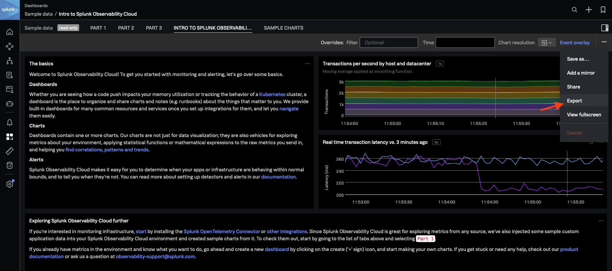

# Example

For this example we've exported one of the example data dashboard from SignalFX and we are using the module to convert it into terraform ready parameters.

You can find the export button in the top right corner of the dashboard.

